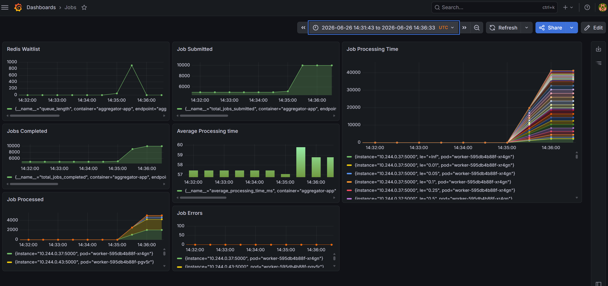

# MonitoringApp

A production-ready Node.js microservices application demonstrating job queue processing, Prometheus metrics collection, and Kubernetes deployment patterns with auto-scaling.

## Architecture

Three independently deployable services communicate via Redis:

```
                     ┌─────────────────────────────────────────────┐
                     │              Kubernetes Cluster              │
                     │                                             │
 Client ──► Ingress ─┤─► Server (port 4000)                        │
                     │       │                                     │
                     │       └──► Redis Queue ──► Worker (port 5000)│
                     │                │               │            │
                     │                └──► Aggregator (port 7000)  │
                     │                                             │
                     │    Prometheus ──► Grafana (grafana.monitor.local)
                     └─────────────────────────────────────────────┘
```

| Service    | Port | Replicas   | Purpose                       |
| ---------- | ---- | ---------- | ----------------------------- |
| Server     | 4000 | 2          | Job submission API            |
| Worker     | 5000 | 2–10 (HPA) | Job processing with metrics   |
| Aggregator | 7000 | 1          | Stats aggregation and metrics |

## Services

### Server

Accepts job submissions and exposes status queries.

**Endpoints:**

- `POST /api/submit` — Queue a new job
- `GET /api/status/:id` — Get job status by ID
- `GET /healthz` — Health check

### Worker

Processes jobs from the BullMQ queue using Node.js Worker Threads for CPU-intensive tasks. Runs up to 10 concurrent jobs and exposes Prometheus metrics.

**Tasks executed per job:**

1. **Prime generation** — Sieve of Eratosthenes up to 100,000
2. **Array sorting** — Sort 100,000 random numbers
3. **Data encryption** — BCrypt hash with salt rounds = 10

**Metrics exposed (`/metrics`):**

- `jobs_processed_total` — Counter of successfully completed jobs
- `job_errors_total` — Counter of failed jobs
- `job_processing_time_seconds` — Histogram of job durations

**Endpoints:**

- `GET /metrics` — Prometheus scrape endpoint
- `GET /healthz` — Health check

### Aggregator

Reads Redis counters and exposes aggregated statistics for both JSON consumers and Prometheus.

**Endpoints:**

- `GET /stats` — JSON summary of queue health
- `GET /metrics` — Prometheus metrics endpoint
- `GET /healthz` — Health check

**Metrics exposed:**

- `total_jobs_submitted` — Gauge
- `total_jobs_completed` — Gauge
- `queue_length` — Gauge
- `average_processing_time_ms` — Gauge

## Tech Stack

| Category              | Technology                  |
| --------------------- | --------------------------- |
| Runtime               | Node.js 24                  |
| Language              | TypeScript 6                |
| Framework             | Express 5                   |
| Job Queue             | BullMQ                      |
| Cache / Queue Backend | Redis (ioredis)             |
| Metrics               | prom-client (Prometheus)    |
| Containerization      | Docker (multi-stage builds) |
| Orchestration         | Kubernetes                  |
| Monitoring            | Prometheus + Grafana        |

## Project Structure

```
MonitoringApp/
├── src/
│   ├── index.ts                    # Server entry point
│   ├── worker.ts                   # Worker entry point
│   ├── aggregator.ts               # Aggregator entry point
│   ├── configs/
│   │   ├── redis.ts                # Redis singleton client
│   │   ├── cors.ts                 # CORS middleware
│   │   ├── worker-metrices.ts      # Worker Prometheus metrics
│   │   └── aggregator-metrices.ts  # Aggregator Prometheus metrics
│   ├── controller/
│   │   ├── job.ts                  # Job scheduling and status
│   │   ├── stats.ts                # Stats aggregation from Redis
│   │   └── task.ts                 # Computational tasks
│   ├── routes/
│   │   └── jobRoutes.ts            # API route definitions
│   └── workers/
│       ├── task-worker.ts          # Worker thread orchestration
│       └── task-runner.ts          # Worker thread execution
├── kubernetes/                     # All K8s manifests
├── server-dockerfile.yml
├── worker-dockerfile.yml
└── aggregator-dockerfile.yml
```

## Getting Started

### Prerequisites

- Node.js 24+
- Redis instance running locally or via Docker
- Docker (for containerized runs)
- kubectl + a Kubernetes cluster (for K8s deployment)

### Local Development

Install dependencies:

```bash
npm install
```

Copy and configure environment variables:

```bash
cp .env.development .env
# Set REDIS_HOST, REDIS_PORT, REDIS_PASSWORD as needed
```

Start each service in watch mode (three separate terminals):

```bash
# Terminal 1 — Server
npm run dev

# Terminal 2 — Worker
npm run dev:worker

# Terminal 3 — Aggregator
npm run dev:aggregator
```

### Build

```bash
npm run build
```

Start production builds:

```bash
npm run start            # Server
npm run start:worker     # Worker
npm run start:aggregator # Aggregator
```

## Docker

Each service has its own multi-stage Dockerfile that compiles TypeScript and installs only production dependencies.

```bash
# Build images
docker build -f server-dockerfile.yml -t vishalmindfiresolutions/monitor:1.0.0 .
docker build -f worker-dockerfile.yml -t vishalmindfiresolutions/monitor-worker:1.0.0 .
docker build -f aggregator-dockerfile.yml -t vishalmindfiresolutions/monitor-aggregator:1.0.1 .
```

## Kubernetes Deployment

### Prerequisites

- Redis deployed via Helm (see `kubernetes/redis-config.yaml`)
- Prometheus Operator installed (for ServiceMonitor CRDs)
- Ingress controller configured

### Deploy Prometheus-grafna-stack

```bash
helm install prometheus prometheus-community/kube-prometheus-stack
```

### Deploy Redis

```bash
helm install my-redis bitnami/redis -f kubernetes/redis-config.yaml
```

### Deploy Master Server

```bash
kubectl apply -f kubernetes/server-deployment.yaml
kubectl apply -f kubernetes/master-app-service.yaml
```

### Deploy Worker Server

```bash
kubectl apply -f kubernetes/worker-deployment.yaml
kubectl apply -f kubernetes/metrics-service.yaml
kubeclt apply -f kubernetes/service-monitor.yaml
```

### Deploy Aggregator Server

```bash
kubectl apply -f kubernetes/aggregator-deployment.yaml
kubectl apply -f kubernetes/aggregator-service.yaml
kubeclt apply -f kubernetes/aggregator-service-monitor.yaml
```

## Deply Ingress - NGINX, GRAFNA

```bash
helm install ingress-nginx ingress-nginx/ingress-nginx -f kubernetes/ingress-loadbalancer.yaml --namespace ingress-nginx --create-namespace
kubectl apply -f kubernetes/ingress-resource.yaml
kubectl apply -f kubernetes/ingress-grafna.yaml
```

## Deploy HPA

```bash
kubectl apply -f kubernetes/horizontal-pod-autoscaler.yaml
```

This creates:

- Deployments for server (2 replicas), worker (2 replicas), and aggregator (1 replica)
- ClusterIP services for each
- Ingress rules for the server and Grafana
- ServiceMonitors for Prometheus scraping (worker at 15s, aggregator at 1s)
- HPA for the worker (scales 2–10 pods at 20% CPU utilization)

### Access the Application

Add these entries to your `/etc/hosts` (or `C:\Windows\System32\drivers\etc\hosts`):

```
<INGRESS_EXTERNAL_IP>  service.monitor.local
<INGRESS_EXTERNAL_IP>  grafana.monitor.local
```

Then:

- API: `http://service.monitor.local`
- Grafana: `http://grafana.monitor.local`

## Monitoring

Prometheus scrapes both the worker and aggregator via `ServiceMonitor` resources. Grafana connects to Prometheus as a data source and can be used to build dashboards using the exposed metrics.

Key metrics to dashboard:

- `jobs_processed_total` — Job throughput over time
- `job_processing_time_seconds` — Latency histogram
- `queue_length` — Backpressure indicator
- `average_processing_time_ms` — Trend tracking
- `job_errors_total` — Error rate

## Auto-Scaling

The worker deployment is managed by a Horizontal Pod Autoscaler:

```yaml
minReplicas: 2
maxReplicas: 10
targetCPUUtilizationPercentage: 20
```

Under load (e.g., via `kubernetes/load-test.js`), the worker scales up automatically and scales back down when idle.

## Environment Variables

| Variable             | Description                        | Default       |
| -------------------- | ---------------------------------- | ------------- |
| `REDIS_HOST`         | Redis hostname                     | `localhost`   |
| `REDIS_PORT`         | Redis port                         | `6379`        |
| `REDIS_PASSWORD`     | Redis auth password                | —             |
| `WORKER_CONCURRENCY` | Max concurrent jobs per worker pod | `10`          |
| `NODE_ENV`           | Runtime environment                | `development` |

## Scripts

| Script                   | Description                    |
| ------------------------ | ------------------------------ |
| `npm run dev`            | Start server in watch mode     |
| `npm run dev:worker`     | Start worker in watch mode     |
| `npm run dev:aggregator` | Start aggregator in watch mode |
| `npm run build`          | Compile TypeScript to `dist/`  |
| `npm run type-check`     | Type-check without emitting    |
| `npm run lint`           | Run ESLint                     |
| `npm run lint:fix`       | Run ESLint with auto-fix       |
| `npm run format`         | Format with Prettier           |
| `npm test`               | Run Jest tests                 |

## Load Testing

```bash
    k6 run kubernetes/load-test.js
```


